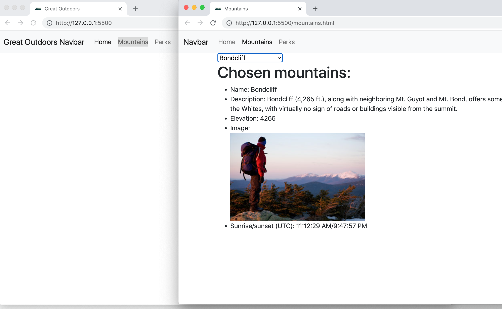
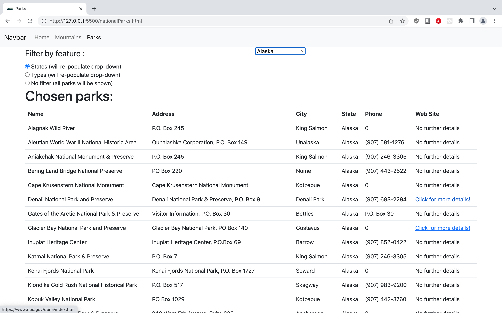

A sample site for Capstone 2 volunteering.

Deployed via [GitHub pages](https://docs.github.com/en/pages/getting-started-with-github-pages/creating-a-github-pages-site) to https://snychka.github.io/capstone2

Pages:




Interesting code:
```
// https://stackoverflow.com/questions/42853028/removing-li-from-ul-in-for-loop-js
// https://developer.mozilla.org/en-US/docs/Web/API/Node/removeChild#simple_examples
// for a ul, the following should work!
//   function clearList(ul) { let a = Array.from(ul.children); a.forEach(x => ul.removeChild(x)); }
//
// generic, clears an element of its children
function clearElement(el) {
    while (el.firstChild) {
        el.removeChild(el.firstChild);
    }
}
```

